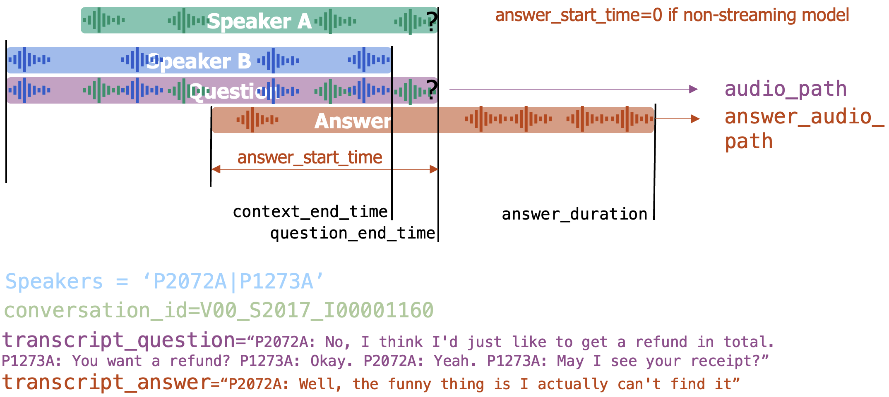

# SPEARBench

SPEARBench is a benchmark repository created for the SPEAR project, funded by Amazon and developed at Johns Hopkins University.

The benchmark evaluates speech-to-speech language models in conversational settings. It prepares question-answer dialogue clips from Seamless Interaction, runs speech-to-speech LLM inference, transcribes answers, computes audio/text metrics, scores naturalness and STANCE behavior, extracts explainable baseline features, and generates reports.

## Data Setup

SPEARBench builds evaluation clips from the Seamless Interaction dataset. Download the `dev` and `test` splits for both labels used by the benchmark:

- `improvised/dev`
- `improvised/test`
- `naturalistic/dev`
- `naturalistic/test`

You can download Seamless Interaction with the official repository:

```bash
git clone https://github.com/facebookresearch/seamless_interaction
cd seamless_interaction
pip install -e .
```

Then download the required splits with the official `SeamlessInteractionFS` API. The example below downloads one batch/archive; increase the batch/archive coverage as needed for your run.

```python
from pathlib import Path
from seamless_interaction.fs import SeamlessInteractionFS, DatasetConfig

root = Path("/path/to/seamless_interaction/datasets")

for label in ["improvised", "naturalistic"]:
    for split in ["dev", "test"]:
        config = DatasetConfig(
            label=label,
            split=split,
            local_dir=root,
            preferred_vendors_only=True,
        )
        fs = SeamlessInteractionFS(config=config)
        fs.download_batch_from_hf(batch_idx=0, archive_list=[0])
```

The benchmark expects the downloaded data to be formatted like this:

```text
seamless_interaction/
└── datasets/
    ├── assets/
    │   ├── dyad_lookup.csv
    │   ├── filelist.csv
    │   ├── interactions.csv
    │   ├── interactions_role.csv
    │   ├── interactions_role_ABmapped.csv
    │   ├── participants.csv
    │   └── relationships.csv
    ├── improvised/
    │   ├── dev/0000/0000/<file_id>.wav
    │   └── test/0000/0000/<file_id>.wav
    └── naturalistic/
        ├── dev/0000/0000/<file_id>.wav
        └── test/0000/0000/<file_id>.wav
```

Each participant file should have the matching annotation JSON next to the audio:

```text
<file_id>.wav
<file_id>.json
```

The benchmark scripts read the dataset through `config.sh`:

```bash
seamless_data_dir="/path/to/seamless_interaction/datasets/"
seamless_assets_dir="data/seamless_assets"
```

If your data lives outside this repository, either point `seamless_data_dir` to that location or create a symlink.

## Installation

The benchmark uses the conda environment defined in `environment.yml`.

From this directory:

```bash
conda env create -f environment.yml
conda activate spearbench
```

If you update `environment.yml` later, refresh the environment with:

```bash
conda env update -f environment.yml --prune
```

The environment currently uses Python 3.11 and CUDA 11.8 PyTorch wheels, including:

```text
torch==2.7.1+cu118
torchaudio==2.7.1+cu118
torchvision==0.22.1+cu118
```

It also installs packages used by the benchmark pipeline, including `pandas`, `scipy`, `scikit-learn`, `librosa`, `matplotlib`, `seaborn`, `soundfile`, `qwen-asr`, `silero-vad`, `sentence-transformers`, and the VoxLect/Whisper dependencies.

## Configuration

Before running the benchmark, edit `config.sh` so it points to your local data, model, and protocol settings.

Important fields:

- `seamless_data_dir`: path to the Seamless Interaction dataset directory.
- `seamless_assets_dir`: path to the benchmark assets directory, usually `data/seamless_assets`.
- `protocol`: name of the benchmark protocol to create and evaluate. The current default is `seamless_2t_2s_questions`.
- `data_dir`: derived output data directory for the selected protocol.
- `llm_model`: speech-to-speech LLM used to generate answers. Current proxy files include `gpt-audio-1.5`, `gpt-realtime-2`, and the older `gpt-4o-audio-preview-2025-06-03`.
- `language_id_model`: Hugging Face audio language ID model, currently `facebook/mms-lid-126`.
- `dialect_id_model`: VoxLect dialect model used by the language/dialect stage.
- `asr`: ASR model name used in report labels. Transcription currently runs both `Qwen3-ASR-0.6B` and `whisper-large-v3`.
- `stance_llm_model`: LLM used as the STANCE judge.
- `statistical_test`: statistical test used by report p-values.

OpenAI-based scripts read credentials from `openai_keys.sh`. Create or edit that file before running LLM inference or STANCE scoring:

```bash
openai_api_key="YOUR_API_KEY"
org="YOUR_ORG_ID"
```

## Command Helpers

Pipeline scripts source `cmd.sh` to build Slurm launch commands in a consistent way. The main helper is:

```bash
$(python_cmd JOB_NAME --cpu)
$(python_cmd JOB_NAME --gpu)
```

`JOB_NAME` is the Slurm job name, and the flag selects the scheduler resources. For example:

```bash
$(python_cmd SB10-S1 --gpu) bin/base_metrics.py --metadata metadata.csv --outputs base_metrics.csv
$(python_cmd SB51-S3 --cpu) bin/reports/generate_html_report.py --protocol "$protocol" --model "$llm_model" --report-dir "$report_dir"
```

With the current `cmd.sh`, these expand to commands like:

```bash
srun -p gpu --gpus 1 --exclude=c19,c21,octopod --job-name SB10-S1 python3
srun -p cpu --cpus-per-task 4 --exclude=c19,c21,octopod --job-name SB51-S3 python3
```

Use `python_cmd` for Python stages. `srun_cmd JOB_NAME --cpu|--gpu` is also available when a script needs the Slurm prefix without automatically appending `python3`. Edit `cmd.sh` if the cluster partition, GPU count, CPU count, or excluded nodes need to change.

## Model Proxies

`02_run_LLM_inference.sh` selects a model proxy based on `llm_model`. Each speech-to-speech backend should have a module at:

```text
benchmark/bin/llm_proxies/${llm_model}.py
```

The proxy must define `get_reply_with_audio(...)` and return the answer audio bytes, answer transcript, finish reason, success flag, and answer start time. `run_LLM_inference.py` saves only the answer audio, not the full question+answer conversation.

## Data Layout

`01_prepare_data_from_seamless.sh` writes question clips under:

```text
data/$protocol/inputs/$split/$subset/
```

and original answer clips under:

```text
data/$protocol/outputs/original/$split/$subset/
```

LLM-generated answer clips are written under:

```text
data/$protocol/outputs/$llm_model/$split/$subset/
```

Each metadata CSV uses the current question-answer schema. The diagram below illustrates how the fields created by `01_prepare_data_from_seamless.sh` relate to the question and answer audio:



- `audio_path`: question/context audio clip.
- `answer_audio_path`: answer-only audio clip.
- `context_end_time`: time in `audio_path` where the final context ends and the question turn begins.
- `question_end_time`: time in `audio_path` where the question ends.
- `answer_duration`: duration of the answer-only audio.
- `speakers`: pipe-separated speaker IDs.
- `conversation_id`: source Seamless conversation ID.
- `transcript_question`: text for the context and question.
- `transcript_answer`: text for the answer.
- `answer_start_time`: answer onset relative to the end of the question. `0` means immediate answer, positive values mean a pause, and negative values mean the answer starts before the question audio has fully ended.
- `finish_reason`: LLM proxy finish status, present for generated outputs.

This split question/answer layout is important: most metric scripts analyze `answer_audio_path`, while naturalness and STANCE reconstruct the two-turn interaction when they need the question and answer together.

## Pipeline Scripts

Run scripts from the `benchmark` directory. The scripts are numbered in the intended pipeline order.

### `01_prepare_data_from_seamless.sh`

Creates the benchmark data from Seamless Interaction. It selects two-speaker dialogues with at least two turns where a speaker asks a question and the next speaker answers. It exports:

- question/context stereo clips to `data/$protocol/inputs/$split/$subset/audios/`;
- original answer-only stereo clips to `data/$protocol/outputs/original/$split/$subset/audios/`;
- metadata with `context_end_time`, `question_end_time`, `answer_start_time`, and answer transcript fields.

After preparation, `bin/data_prep_summary.py` prints a compact summary for the original-answer outputs.

### `02_run_LLM_inference.sh`

Runs speech-to-speech LLM inference on the prepared question clips. It sends each `audio_path` from the input metadata to the configured proxy and writes generated answer-only audio to `data/$protocol/outputs/$llm_model/$split/$subset/audio/`.

The runner keeps the original question metadata and adds or updates:

- `answer_audio_path`
- `transcript_answer`
- `answer_start_time`, stored relative to `question_end_time`
- `answer_duration`
- `finish_reason`

Existing output metadata causes the script to skip that split/subset.

### `03_transcribe.sh`

Runs ASR over original and generated answer audio for both `dev` and `test`, both subsets, and both models. It currently runs:

- `Qwen3-ASR-0.6B`
- `whisper-large-v3`

Transcript CSVs are written next to each metadata file, for example:

```text
data/$protocol/outputs/$model/$split/$subset/Qwen3-ASR-0.6B_transcripts.csv
data/$protocol/outputs/$model/$split/$subset/whisper-large-v3_transcripts.csv
```

### `10_compute_base_metrics.sh`

Computes answer-level base metrics for every split/subset/model combination and writes:

```text
results/$protocol/$model/$split/$subset/base_metrics.csv
```

Current metrics include WER/CER when ASR transcripts are present, response latency from VAD, interruption count, interrupted time in milliseconds, and UTMOS speech quality. These metrics operate on `answer_audio_path` and use `answer_start_time` for interruption-related measures.

### `11_language_dialect.sh`

Runs language and dialect analysis on answer audio. With no arguments it runs all stages:

```bash
bash 11_language_dialect.sh
```

Optional stages:

```bash
bash 11_language_dialect.sh --language
bash 11_language_dialect.sh --dialect
bash 11_language_dialect.sh --summary
bash 11_language_dialect.sh --all
```

Stage 1 writes language predictions to:

```text
results/$protocol/$model/$split/$subset/language_id.csv
```

Stage 2 writes dialect predictions to:

```text
results/$protocol/$model/$split/$subset/dialect_id.csv
```

Dialect prediction uses language predictions to decide whether an utterance should be sent to the English VoxLect model. The summary stage prints language and dialect aggregate counts for `original` and `$llm_model`.

### `20_naturalness_feats.sh`

Extracts VoxProfile-style Whisper emotion features used by the naturalness model for `dev` and `test`, both subsets, and both `original` and `$llm_model` outputs.

`bin/naturalness/extract_features.py` now handles the split question/answer layout. For each metadata row it:

- loads the question from `audio_path`, using only `context_end_time` through the end of the question file;
- loads the full answer from `answer_audio_path`;
- chunks each turn separately with the configured sliding 3 second windows;
- computes question embeddings and answer embeddings separately;
- concatenates the resulting embeddings and saves them under a single base key, so downstream scoring sees one sequence for the row;
- skips rows where all expected embedding chunks already exist;
- skips questions shorter than `--min-len-question`, currently set to `3.0` by the shell script.

Features are saved under:

```text
data/$protocol/outputs/$model/$split/$subset/naturalness/voxprofile_features/
```

### `21_extract_relations_context.sh`

Builds text embedding caches used by naturalness scoring from input metadata and Seamless asset files. It writes:

```text
data/$protocol/inputs/$split/$subset/context_hf_cache.pkl
data/$protocol/inputs/$split/$subset/relationship_hf_cache.pkl
```

### `22_score_naturalness.sh`

Scores utterances with the trained naturalness model. It combines precomputed audio embeddings with cached context and relationship embeddings and writes outputs under:

```text
results/$protocol/$model/$split/$subset/
```

The current shell script runs this scoring stage for both `test` and `dev`, across both subsets and both `original` and `$llm_model`.

### `30_run_LLM_inference_STANCEs.sh`

Builds STANCE question CSVs and uses an LLM judge to score stance/tone/style dimensions. It currently runs STANCE question indices `0` through `9` for `dev` and `test`, only on the `improvised` subset, for both `original` and `$llm_model`. The naturalistic subset is intentionally skipped because the STANCE setup depends on ground-truth stance role metadata available for improvised interactions.

For each question index, `bin/STANCE/make_questions.py` filters rows by role/category and writes:

```text
data/$protocol/outputs/$model/$split/improvised/stance_questions_Q<idx>.csv
```

`bin/STANCE/score.py` then sends a patched two-turn audio file to the judge model. It loads the question from `audio_path`, the answer from `answer_audio_path`, and reconstructs their timing using `answer_start_time`:

- `answer_start_time == 0`: answer starts immediately after the question.
- `answer_start_time > 0`: silence is inserted before the answer.
- `answer_start_time < 0`: the answer overlaps the end of the question, representing an interruption.

The temporary patched WAV is deleted after the request. STANCE metrics are written under:

```text
results/$protocol/$model/$split/improvised/
```

### `31_compute_STANCE_metrics.sh`

Merges STANCE outputs from `original` and `$llm_model` for `dev` and `test`, improvised only. The merged output is:

```text
results/$protocol/$llm_model/$split/improvised/merged_stances.csv
```

### `40_extract_explainable_features.sh`

Extracts explainable distributional baseline features for every split/subset/model combination. It computes prosodic, lexical, temporal, and relationship-aware features from metadata and audio, then writes:

```text
results/$protocol/$model/$split/$subset/distrib_baselines_features.csv
```

### `41_use_features_for_baseline.sh`

Uses the explainable features from script `40`. It has two optional stages:

```bash
bash 41_use_features_for_baseline.sh --scores
bash 41_use_features_for_baseline.sh --clusters
bash 41_use_features_for_baseline.sh --all
```

If no option is passed, both stages are run.

Stage 1, `--scores`, trains dev-set per-feature baselines and scores test utterances for `$llm_model`. It writes:

```text
results/$protocol/$llm_model/test/$subset/distrib_baselines_feature_scores.csv
results/$protocol/$llm_model/distrib_baselines_summary.csv
```

Stage 2, `--clusters`, loads both `original` and `$llm_model` explainable features before computing correlations. It normalizes from the combined dev set, computes Spearman correlations, clusters features at the configured threshold, validates the groups on test, and fits PCA features. It writes the same cluster definitions and transformed test values back into each model directory:

```text
results/$protocol/$model/test/$subset/correlation_feature_groups_rho0p8.csv
results/$protocol/$model/test/$subset/correlation_cluster_features_rho0p8.csv
```

The cluster feature CSV includes one PCA feature per correlated group plus a `general_explainable_feature_rho0p8` PCA feature across all groups. Features listed in `ignored_explainable_features` in `config.sh` are excluded from both stages and from reports.

### `50_check_missing_files.sh`

Checks whether the expected output files from scripts `01` through `41` have been produced. It sources `config.sh`, then verifies the expected metadata, transcript, metric, language/dialect, naturalness, STANCE, explainable-feature, baseline-score, and correlation-cluster files for every relevant split, subset, and model.

Run it from the benchmark directory with:

```bash
bash 50_check_missing_files.sh
```

It prints one status line per checked combination, for example:

```text
script 10 - model original - subset test/improvised - all computed
script 11 - model $llm_model - subset dev/naturalistic - file missing
```

When files are missing, it prints the missing paths below the status line. The script exits with status `0` if all expected files exist and `1` if any file is missing.

### `51_generate_report.sh`

Generates human-readable reports from pipeline outputs. It has three optional stages:

```bash
bash 51_generate_report.sh --short
bash 51_generate_report.sh --graphs
bash 51_generate_report.sh --long
bash 51_generate_report.sh --all
```

If no option is passed, the script runs all stages.

The short report reads base metrics, naturalness scores, merged STANCE metrics, explainable baseline outputs, and script `41` correlation-cluster PCA features. It writes:

```text
reports/$llm_model/report.txt
reports/$llm_model/metrics-improvised.csv
reports/$llm_model/metrics-naturalistic.csv
```

The graph stage writes plots under:

```text
reports/$llm_model/graphs/
```

The long report stage writes:

```text
reports/$llm_model/detailed_report.html
```

Report generation uses `statistical_test` from `config.sh`, defaulting to Welch t-test if the variable is unset. Explainable features listed in `ignored_explainable_features` are omitted from the short report tables, long report tables, and graphs. The long report includes a dedicated table for `corr_cluster_*` and `general_explainable_feature_*` rows from script `41`.

## Outputs

The main benchmark outputs are written under:

```text
results/$protocol/$model/$split/$subset/
```

Typical outputs include:

```text
base_metrics.csv
language_id.csv
dialect_id.csv
naturalness_scores.csv
naturalness_predictions_raw.csv
stance_metrics_Q<idx>.csv
merged_stances.csv
distrib_baselines_features.csv
distrib_baselines_feature_scores.csv
```

Final report artifacts are written under:

```text
reports/$llm_model/
```

Typical report outputs include:

```text
report.txt
metrics-improvised.csv
metrics-naturalistic.csv
graphs/
detailed_report.html
```

## Notes and Current Assumptions

- Most scripts are intended to be launched from `SPEARBench/benchmark` and source `config.sh`.
- Several scripts submit work with `srun`, so the expected execution environment is an HPC cluster with CPU and GPU partitions named in the scripts.
- Audio metadata paths are stored as relative paths under the benchmark directory in the generated CSVs.
- LLM output audio is answer-only. Scripts that need the full interaction reconstruct it from `audio_path`, `answer_audio_path`, and `answer_start_time`.
- STANCE currently runs on `improvised` only.
- Naturalness feature extraction skips already-computed embedding chunks; remove the existing `naturalness/voxprofile_features` directory if you need a clean recompute.

## Contact

For questions, please contact:

**Thomas Thebaud**  
_Assistant Research Professor_ <br>
ECE department, Johns Hopkins University
`tthebau1@jhu.edu`

## Citation

If you use this benchmark, please cite the SPEAR article.

ArXiv: `<ARXIV_LINK_PLACEHOLDER>`

```bibtex
@article{spearbench2026,
  title   = {SPEAR: Evaluating Speech-to-Speech Language Models in Conversational Settings},
  author  = {Thebaud, Thomas and others},
  journal = {arXiv preprint},
  year    = {2026},
  url     = {ARXIV_LINK_PLACEHOLDER}
}
```
